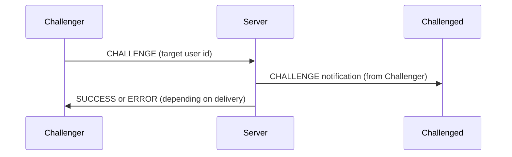
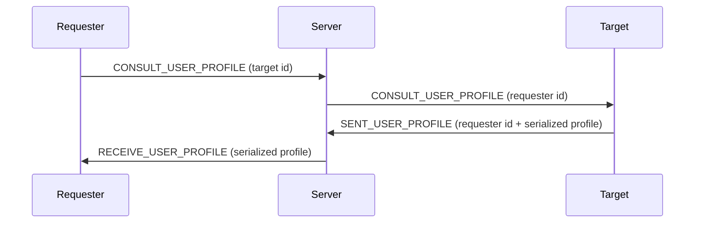

# Awalnet

A simple C project with Makefile build system.

## Building

To build the project:
```bash
make
```

To clean build artifacts:
```bash
make clean
```

To build and run:
```bash
make && ./bin/awalnet
```

## Project Structure

- `src/` - Source files (.c and .h)
- `bin/` - Build output directory (excluded from git)
- `bin/obj/` - Object files (.o)
- `Makefile` - Build configuration

## Processes

### CONNECT
```mermaid
sequenceDiagram
    participant Client
    participant Server
    Client->>Server: CONNECT (username)
    Server->>Client: Serialized User (User struct)
    
 ``` 


### LIST_USERS
```mermaid
sequenceDiagram
participant Client
participant Server
Client->>Server: LIST_USERS
Server->>Client: List of connected users (usernames + ids)
```

### CHALLENGE


### CONSULT_USER_PROFILE

