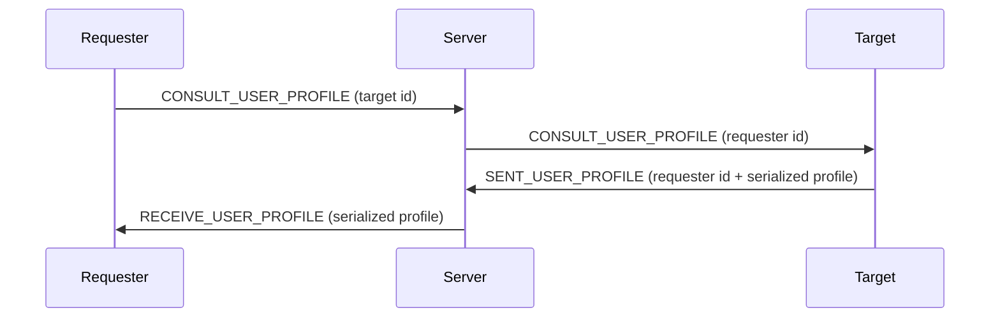
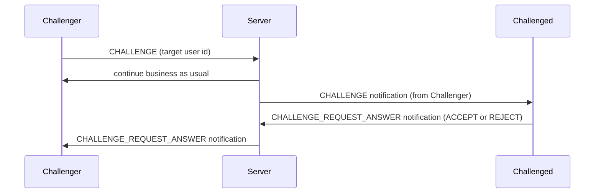
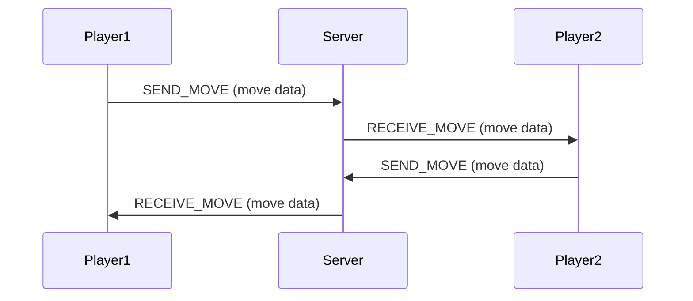

# Awalnet

A simple C project with Makefile build system.

## Building

To build the project:
```bash
make
```

To clean build artifacts:
```bash
make clean
```

To build and run:
```bash
make && ./bin/awalnet
```

## Project Structure

- `src/` - Source files (.c and .h)
- `bin/` - Build output directory (excluded from git)
- `bin/obj/` - Object files (.o)
- `Makefile` - Build configuration

## Processes


### CONNECT
```mermaid
sequenceDiagram
    participant Client
    participant Server
    Client->>Server: CONNECT (username)
    Server->>Client: CONNECT_CONFIRM and Serialized User (User struct)
    
 ``` 

### LIST_USERS
```mermaid
sequenceDiagram
participant Client
participant Server
Client->>Server: LIST_USERS
Server->>Client: List of connected users (usernames + ids)
```


### CONSULT_USER_PROFILE


### CHALLENGE (when a user challenges another user)


A player cannot challenge multiple players at the same time. This rule is applied on the client side.

A challenged player can be challenged by multiple players at the same time. The server will forward all the challenges to the challenged player. For now, the challenged player can only send an answer to the last received challenge. If he accepts it, the other pending challenges will be answered as refused.

A player cannot challenge another player who is already in a game. The server will refuse the challenge request in this case.

When a player challenges another player, if he receives a challenge afterward, while he is waiting for an answer to his challenge, and he accepts it, the server will consider that he canceled his previous challenge and notify the challenged (if he had accepted the challenge).


### GAME MODE - GAME LOOP


## NOTES
!! when an error is returned from the server, it also sends the id of the previous call to help the client identify which call caused the error !!

The game logic is implemented on the client side to ease server load. It means that the server only receives the moves and sends them to the opponent without any validation because the move validation has been done by the player sending it.
Also, both player and client have a copy of the game board state so they can render it locally without exchanging it.
But ultimately, it is the server who stops the game when a player wins or when there is a draw or when a player disconnects.


When a player challenges another player, if he receives a challenge and has not answered it when the answer to his challenge arrives, it won't know he has been answered.

# IMPLEMENTATIONS 


✅Implement the Awalé game: internal representation, how to play a move, count points, save a game, print the board state, etc.

✅ Design a client/server application. Each client registers with a username.

✅ Each client can request from the server the list of online usernames.

✅ Client A can challenge client B. B can accept or refuse.

✅ When a match is created between A and B, the server randomly decides who starts. 

✅ The server verifies the legality of moves (using the code created in step 0) --> it is the client that verifies the legality of moves in our code.

✅ If you have a working version for one game, ensure it also works for multiple simultaneous games. 

✅ You can add features such as listing ongoing games 

✅ and an “observer” mode where the server sends the board and score to C who observes the game between A and B.

✅ Implement a chat option, in addition to sending moves, players can exchange messages to chat (both inside and outside a game).

✅ Allow a player to write a bio, say 10 ASCII lines to introduce themselves. The server should be able to display the bio of a given username.

❌ Add a private mode, a player can limit the list of spectators to a list of friends. Implement this feature.

❌ Add the ability to save played games so they can be reviewed later.

❌ Free to your imagination, player rankings (Wikipedia article on Elo rating), tournament organization, adapting it to another game, etc.
