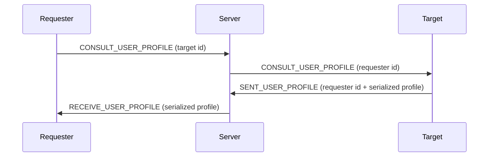
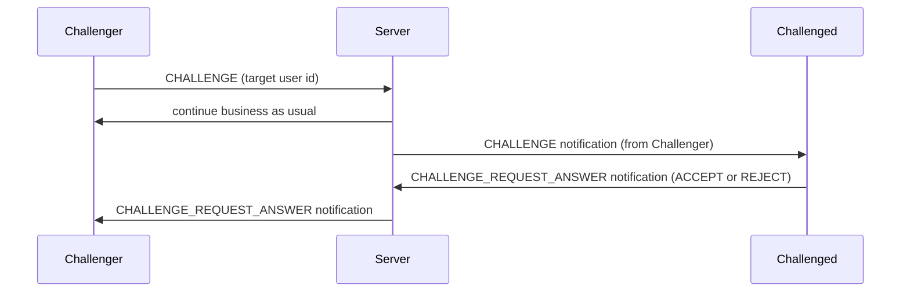
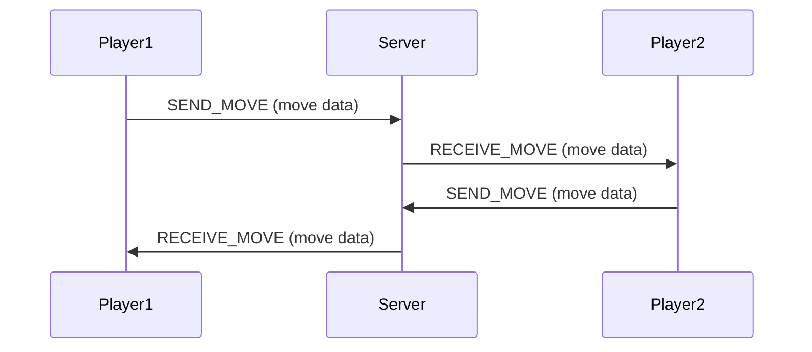

# Awalnet

A simple C project with Makefile build system.

## Building

To build the project:
```bash
make
```

To clean build artifacts:
```bash
make clean
```

To build and run:
```bash
make && ./bin/awalnet
```

## Project Structure

- `src/` - Source files (.c and .h)
- `bin/` - Build output directory (excluded from git)
- `bin/obj/` - Object files (.o)
- `Makefile` - Build configuration

## Processes


### CONNECT
```mermaid
sequenceDiagram
    participant Client
    participant Server
    Client->>Server: CONNECT (username)
    Server->>Client: Serialized User (User struct)
    
 ``` 

### LIST_USERS
```mermaid
sequenceDiagram
participant Client
participant Server
Client->>Server: LIST_USERS
Server->>Client: List of connected users (usernames + ids)
```


### CONSULT_USER_PROFILE


### CHALLENGE (when a user challenges another user)


### GAME MODE - GAME LOOP


## NOTES
!! when an error is returned from the server, it also sends the id of the previous call to help the client identify which call caused the error !!

The game logic is implemented on the client side to ease server load. It means that the server only receives the moves and sends them to the opponent without any validation because the move validation has been done by the player sending it.
Also, both player and client have a copy of the game board state so they can render it locally without exchanging it.
But ultimately, it is the server who stops the game when a player wins or when there is a draw or when a player disconnects.
